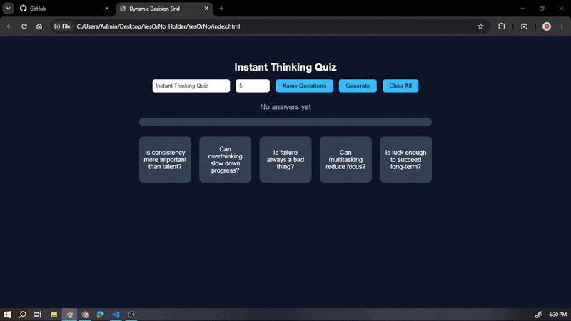

# 🧠 YesOrNo – Dynamic Decision Grid

A clean, interactive web application that helps users make **quick decisions** using a visual **YES / MAYBE / NO** grid.

Built using pure **HTML, CSS, and JavaScript**, this project focuses on speed, clarity, and intuitive user interaction.

---

## 🎥 Demo Preview



---

## 🔗 Live Demo

👉 **Live Demo:** [ClickMe](https://rawcdn.githack.com/Aditya-xcity/YesOrNo-Decision-Grid/e0db6ed1dbe4814beff4c0d9b4c601cd72c0fbdd/YesOrNo/index.html)


---

## ✨ Features

* 🔢 Generate **1 to 200 questions** dynamically
* 📝 Custom question titles
* 🖱️ Mouse-based decisions:

  * Left Click → **YES**
  * Middle Click → **MAYBE**
  * Right Click → **NO**
* 🎨 Color-coded answers for clarity
* 📊 Live YES / MAYBE / NO counters
* 📈 Progress bar showing completion percentage
* 🔐 Clear All option with confirmation modal
* 📱 Responsive grid layout

---

## 🧠 Why This Project Matters

This project demonstrates core frontend development concepts:

* State management using JavaScript arrays
* Event-driven programming (mouse + keyboard)
* UX-focused design with instant visual feedback
* Scalable and responsive layout
* No frameworks — strong fundamentals

Ideal for:

* Self-assessment tools
* Surveys and evaluations
* Decision analysis systems
* College mini-projects
* Portfolio projects

---

## 🛠️ Tech Stack

* **HTML5** – Structure
* **CSS3** – Styling and layout
* **Vanilla JavaScript** – Logic and interactivity

---

## 📂 Project Structure

```text
YesorNo-Decision-Grid/
│── .gitignore
│
└── YesOrNo/
    │── index.html
    │── style.css
    │
    └── Static/
        │── DemoGif.gif
```

---

## ▶️ How to Run Locally

1. Clone or download the repository
2. Open the `YesOrNo` folder
3. Open `index.html` in any modern browser
4. Enter the number of questions
5. Generate the grid and start deciding

*No setup or installation required.*

---

## 🔮 Future Enhancements

* Save decisions using `localStorage`
* Keyboard-based navigation
* Export results (CSV / JSON)
* Decision analytics
* React-based version
* Deployment using GitHub Pages or Netlify

---

## 👨‍💻 Author

**Aditya Bhardwaj**
B.Tech – Computer Science Engineering

---

## 📜 License

Open for learning, experimentation, and personal use.

---

✨ *Built to turn fast clicks into clear decisions.*

